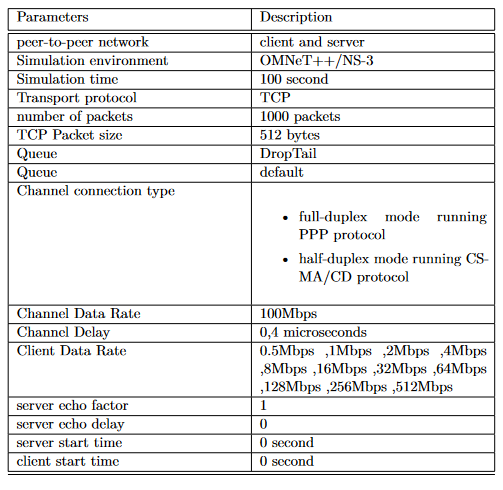

# Analysis of Communication Networks Using Simulators OMNET++ and NS3

## Introduction
---------------------
Communication networks are an essential part of modern society, and their efficient and reliable operation is crucial for various applications such as the internet, telecommunication, and transportation systems. One of the key methods to analyze and design communication networks is through simulation, which allows for the testing and evaluation of different network configurations and protocols in a controlled environment.

This Master's Thesis studies the use of OMNET++ and NS3 network simulators for analyzing communication networks. The study compares the performance of the two simulators based on network performance criteria such as packet loss rate, throughput, end-to-end delay, jitter, collisions, number of events, and simulation time. This work is necessary due to a lack of research comparing the two simulators when it comes to simulating legacy telecommunication technologies such as CSMA/CD and PPP protocols.

## Motivation
---------------------
CSMA/CD and PPP protocols were chosen in this study as they are legacy telecommunication technologies that have been widely used in the past and have a significant impact on the performance of communication networks. Despite their widespread use, there is a lack of research comparing the performance of these protocols when simulated using OMNET++ and NS3. Additionally, simulating these mature and standardized protocols should result in accurate and reliable results, making them a valuable addition to the study.

## Technical requirements
---------------------
* OMNET++ 5.6.2 
* NS3 3.34
* Windows operating system

## Setup
---------------------
* Install windows subsystem for linux (wsl)
* Install OMNET++ and NS3; installation guides and required files are available in the respective GitHub repositories.
* Clone or download the project repository, one for OMNET++ and one for NS3.
* Follow the guide provided in the repository's README file to set up and create new projects for each simulator.
* Follow the guide and video tutorials on running the code and extracting the results.

## Usage
---------------------
* This repository includes simulation codes for both OMNET++ and NS3. Once the project is set up, following the instructions in the README file, the user can run the simulation in Both OMNET++ and  NS3 .
* The simulation allows the user to adjust various parameters such as client data rate, protocol settings (PPP, CSMA/CD), packet size, client delay, server delay, packet echoed to the client, to analyze the impact of different scenarios on network performance.
* The results can be exported from the IDE/Console in the form of graphs and tables. These results can then be analyzed further using other software such as Excel or Google Colab to gain deeper insights and draw more accurate conclusions.

## Methodology
---------------------
To conduct the study, two identical projects were created, one for each simulator. The default setup for the simulation included a wired peer-to-peer network with a client and a server running a single TCP application. The cable was configured with a data rate of 100Mbps and a delay of 0.4 microseconds. The client sent a preset number of packets to the server periodically at a configurable data rate. The simulation was run with two different cable types: full-duplex mode with PPP protocol and half-duplex mode with CSMA/CD protocol.

The following is a topology used:

This is the socket diagram that shows what each machine does, the server starts waiting for new connection, then the client machine establishes a Tcp connection with the server, then it starts sending packets and for each packet the server can echo after a configurable delay:

This table shows the default setup configuration:

## Documentation
---------------------
The code is commented and there is a web-based documentation you can browse to further understand the C++ code, you can find it in the form of an archeive under the folders [OMNET++](./OMNET++) and [NS3](./Ns3). Unzip the files then open index.html. There is also a accompanying explanation file that can answer your questions.

To make configuration changes, you can work on the omnet.ini file for Omnet++ and run_point_to_point.sh file for Ns3.

Omnet++ : To better understand Omnet++ ".ini" files use this link [https://doc.omnetpp.org/omnetpp/IDE-Overview.pdf](https://doc.omnetpp.org/omnetpp/IDE-Overview.pdf)
When you run the simulation however, you can use the popup to pick the configuration you want.
The ".ini" file can be used to change the setup, like adding another machine...

Ns3 : the file run_point_to_point.sh is a bash file that runs the simulation and passes the desired arguments, then
it extracts the program output and saves it to a file and greps the results.
You can change the passed parameters, to better understand the function of these parameters run the command :
./waf -v --run "scratch/tcpClientServer.cc --help"

To change the NS3 setup/topology, you need to change the function **simulate()** in the ".cc" file. This link should be useful [How to setup Ns3 topology?](https://www.nsnam.org/docs/tutorial/html/building-topologies.html)

And for Omnet++ you can changes the **.ned*** files.

## Conclusion
---------------------
The results of the simulation were analyzed and compared based on the network performance criteria mentioned above.
The study found that when simulating the half-duplex CSMA/CD protocol, NS3 gave more realistic results than OMNET++. This is because NS3 allows the simulation of the Tx buffer size while OMNET++ has an unlimited Tx buffer size. Additionally, the study found that OMNET++ had a shorter simulation time than NS3.

The study found that OMNET++ and NS3 both have their strengths and weaknesses when it comes to simulating communication networks. OMNET++ is a more general-purpose simulator that can simulate other fields besides networks, (such as transportation system, power systems and some biological system) while NS3 is more specialized in network simulations. However, when it comes to simulating legacy telecommunication technologies such as CSMA/CD and PPP protocols, the study found that NS3 gave more realistic results than OMNET++. Additionally, the study found that OMNET++ has modules ( The Tcp section of Inet framework ) that are unfinished and contain comments such as 'Todo'. OMNET++ could simulate the TxBuffer size if an extension named TcpNsc was used.
